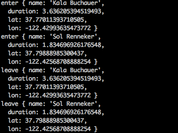

Date: 02-01-2016

# Hackathon: Real-time Map Mashup

## Objective

Put more real-time map data on your team's parking map.

## Real-time Transit

Use the [Transit Open Datasets](https://www.firebase.com/docs/open-data/transit.html)
to plot the real-time locations of bus vehicles on your parking app's map.
The Firebase location corresponding to the city of San Francisco is [sf-muni](https://publicdata-transit.firebaseio.com/sf-muni).

## Real-time Customer Locations

Write a sever-side script to simulate the behaviors of the customers of your app
who are entering and leaving the app. On your parking apps' map, display these
simulated customers in real-time.

A skeleton script is provided at `/workers/simulate-parking-customers.js`.

You need to first install some NPM packages by

`npm install`

To run the worker, assuming you are at the root of your book, do

`node workers/simulate-parking-customers.js`

You should see output like this:

### Hints

* Decide on a Firebase location to store a list of current customers.
* Use the randomly generated name as the key.
* Implement `enter()` and `leave()` by adding the appropriate Firebase API
calls to write and delete customers at that Firebase location of your choice.
* Feel free to adjust the simulator parameters such as the duration.
* On the front-end side (i.e., [/apps/parking/garages_map.html](/apps/parking/garages_map.html)), subscribe to the same Firebase location so that your
app can always show the active customers (those who have entered but have not left).

### Submission

* Use [http://recordit.co/](http://recordit.co/) to create a demo as an animated
gif. Make sure your demo clearly shows three types of real-time activities:
garages, buses, and customers.
* Post it to `#demo` on Slack, along with your team members' names.
