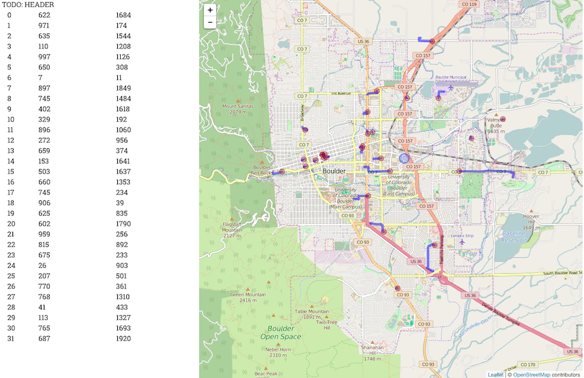
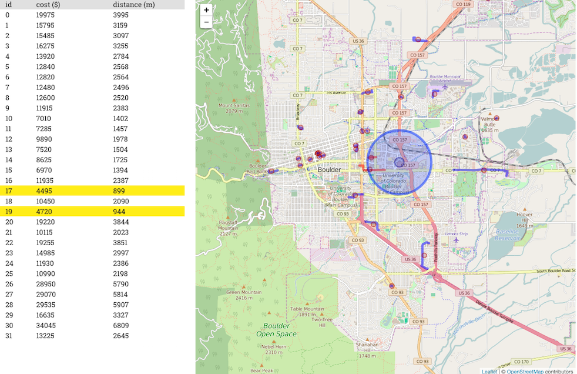

# Team Homework

## Objectives

* Business app: Fiber visualizer and cost estimator
* Build system: [Webpack](http://webpack.github.io/docs/)

## Teaming

For this week's homework, the team size is two. You can opt to work alone too.

Coming up next week, we will merge two teams of two into a bigger team of four to
work on the next milestone of this app.

## Project Template

[https://github.com/ucdd2016/fiber](https://github.com/ucdd2016/fiber)

The template code provides a functional prototype with a basic map interface
and a cost table, show below:

## Requirements

Your team must implement a number of new features such that the app will behave
like the screenshot below:

These features are:

### Map
1. [  ] The center of each fiber is marked by a red circle. In the template code,
the center is marked incorrectly. __(10 points)__
1. [  ] A circle should be drawn to visualize a neighborhood with a radius of 1000
meters centered on the position selected by the user. __(10 points)__
1. [  ] The fiber whose center is within the nearby neighbor radius should be
highlighted in red. __(10 points)__

### Cost Table
1. [  ] There should be a header at the top of the table. __(10 points)__
1. [  ] The distance should be calculated correctly. __(10 points)__
1. [  ] The cost should be calculated based on the distance using a
formula determined by your team. __(10 points)__
1. [  ] The rows corresponding to the fibers within 1000 meters from the selected
position should be highlighted in yellow. __(10 points)__

## Development / Deployment

To run the app in the development mode, run this command:

    npm start

This starts a development server at `http://localhost:3000`

To build a production version of the app, run this command:

    npm run-script build-app

After running this command, a _packaged_ Javascript file `app.js` is created
and saved in `public/js`.

## Webpack

Study the contents in the webpack configuration files. Annotate each line with
a comment to describe your best understanding of the purpose of that line.

* [ ] Annotate `webpack.config.js`  __(10 points)__
* [ ] Annotate `webpack.production.config.js` __(10 points)__

## Submission

The app consists of all the files in `public/`. Your team needs to figure out a
way to host the app. You can use any static site hosting service, such as
Firebase or Github.io.

* [ ] Post a link to your live app to to [#demo](https://ucdd2016.slack.com/messages/demo/). __(10 points)__

## Questions

There are questions embedded in the template code. These questions are meant
for you to study and understand the code thoroughly. You may be asked to answer
these questions to demonstrate your understanding.
