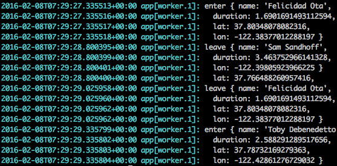

# Team Learning

## Objective

Develop a functional prototype of the app your team designed during the Hackathon

## Due

Friday @ 11:59pm, 2/12/2016

## Requirements

### App

* [ ] The client page ([/apps/uber/client/](/apps/uber/client/)) should look as close to the mockup as possible.
  * [ ] The [_MapView_](/apps/uber/client/components/map.jsx) component should be implemented.
  * [ ] The [_NavBar_](/apps/uber/client/components/navbar.jsx) component should be implemented.
  * [ ] The [_User_](/apps/uber/client/components/user.jsx) component should be implemented.  
* [ ] The admin page ([/apps/uber/admin/](/apps/uber/admin/)) should look as close to the mockup as possible.
  * [ ] The [_ProviderMap_](/apps/uber/admin/components/provider-map.jsx) component should be implemented.
  * [ ] The [_ProviderList_](/apps/uber/admin/components/provider-list.jsx) component should be implemented.  
  * [ ] The [_UserMap_](/apps/uber/admin/components/user-map.jsx) component should be implemented.      
  * [ ] The [_UserList_](/apps/uber/admin/components/user-list.jsx) component should be implemented.

### Worker

* [ ] The script for simulating providers should be implemented (i.e.,
  `workers/uber/simulate-providers.js`). Each provider should move around, rather
  than staying at the same location.
* [ ] The worker should be deployed to Heroku.

## Heroku Hints

### Initial Push

Here's a brief walkthrough of how you can push a script to Heroku to run as
a background worker. This week and next week, you will be practicing pushing
and running worker scripts on Heroku.

Our goal here to push the code under `workers/uber` as an app to Heroku.

Assume you are at the root of your book repo.

Install NPM dependencies

    $ npm install

To execute the worker locally, run

    $ node workers/uber/simulate-providers.js

You should see

To deploy the worker script to Heroku, first, create a Heroku app. The easiest
would be to do it through Heroku's online GUI. Remember the name you chose for
your app, because you will need it for setting a heroku git remote.
Here, the example Heroku app's name is `ucdd2-workers-uber`.

Next, create a heroku git remote to refer to this app. Here, we choose
`heroku-uber` as the name of this remote. You will need to install
[heroku toolbelt](https://toolbelt.heroku.com/).

    $ heroku git:remote -r heroku-uber -a ucdd2-workers-uber    

Finally, push the code, NOT all the code, only the code inside
`workers/uber` to Heroku. To do so, commit the changes to the worker script

    $ git commit -a -m 'some commit message'

Then use git's subtree command.

    $ git subtree push --prefix workers/uber heroku-uber master

Run one worker (no web server)

    $ heroku ps:scale web=0 worker=1

To check if your worker is running correctly, read the logs

    $ heroku logs

You should see something like:

This should look similar to the output of running locally.

### Subsequent Pushes

Each time you made changes to the script (i.e., `workers/uber/simulate-providers.js`).
You can commit the changes

    $ git commit -a -m 'another commit message'

Then run the subtree command to deploy to Heroku again

    $ git subtree push --prefix workers/uber heroku-uber master
